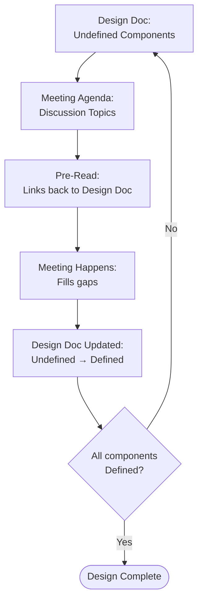

# Meeting Agenda Workflow

Operational reference for AI during meeting agenda creation via hippocampus skill.

**Source of truth:** [Design Doc & Meeting Agenda Methodology](https://mariuswilsch.github.io/public-wilsch-ai-pages/global/design-doc-methodology)

## Relationship to Design Docs

The meeting agenda is the other half of the design doc system. When a design doc component is **Undefined**, its uncertainty moves to a meeting agenda. The meeting fills the gap. The design doc gets updated. The agenda is not a checklist — it's a container for facilitated discovery.

**Creation rule:** Meeting agendas are born during the extraction pass UPDATE step, in the same commit that adds `**Undefined:**` markers to the design doc. They are not created as a standalone task. Every Undefined marker generates exactly one discussion topic — 1:1 mapping, no exceptions. The marker in the design doc links to the meeting agenda topic. The meeting agenda Pre-Read links back to the design doc.

**Why 1:1 matters for extraction:** When a future AI processes the meeting transcript during RESOLVE, the 1:1 mapping lets it trace each discussed topic back to the specific Undefined marker in the design doc. The meeting agenda topic is the bridge between what was discussed (transcript) and where the resolution belongs (design doc section). Without this mapping, connecting transcript content to design doc updates is significantly harder.



## Five-Question Structure

Every meeting agenda answers five questions:

| # | Question | Section | Thinking Function |
|---|----------|---------|-------------------|
| 1 | **WHY** are we meeting? | Meeting Goal | Architect's prediction of what can be resolved — pre-commitment to what the meeting should produce |
| 2 | **WHAT context** does the attendee need? | Pre-Read (optional) | "What do they need to arrive with the same context I have?" — links to design doc, contract, or omit if self-contained |
| 3 | **WHAT unknowns** are we resolving? | Discussion Topics | Decomposition of undefined areas — AI proposes, principles constrain the format |
| 4 | **WHAT outcome?** | Embedded in Meeting Goal | No separate section — the Goal already defines what success looks like |
| 5 | **HOW** does the meeting work? | Meeting Format | Type, duration, expectations |

Meeting Goal and Discussion Topics are always present. Pre-Read and Meeting Format are contextual.

## Discussion Topic Principles

| Principle | Rule |
|-----------|------|
| **Statements, not questions** | Don't interrogate — open space. Questions lead participants toward a specific frame, narrowing the answer space before discussion begins. Statements present the uncertainty without directing how to enter it. The facilitator sees the statement as a visual stimulus and decides in-context which question to ask — the agenda is a trigger, not an interrogation script. |
| **Starting points, not exhaustive** | "Starting points for discussion, not limited to these." Topics open the conversation, don't constrain it. |
| **First-person perspective** | Write for the reader (participant), not third-person observation |
| **No facilitation meta-commentary** | Direct quotes as starters, not "conversation prompt:" framing |
| **Process-general framing** | "What challenges exist in determining hierarchy?" not "What challenges will AI face?" |
| **Stimulus-based facilitation** | Present something concrete → let participants react → infer the process |
| **One topic per Undefined marker** | Every `**Undefined:**` marker in a design doc generates exactly one discussion topic. 1:1 mapping. The marker links to the topic, the topic links back to the design doc section. |
| **Single ask per topic** | Each topic ends with one `**To resolve:**` statement — a single sentence describing the resolution space. Not multiple asks, not questions. The context bullets above carry the specifics. |
| **Time allocation** | Each topic gets a time estimate (⏱️ X min). Prevents meetings from running over and gives participants a visual cue of priority. |

No "Next Steps" section — implied by meeting format.

## Component-by-Component Rhythm

Meeting agendas are created one section at a time, never all at once. AI drafts ONE component, user validates, then next. This is the same rhythm as design doc creation.

**Order:**
1. Meeting Goal
2. Pre-Read
3. Discussion Topics (one topic at a time, each with its own gate)
4. Meeting Format
5. Related

**Turn rule:** Always complete the component draft AND surface any AI uncertainties in the same turn. Uncertainties are always AskUserQuestion — never plain text questions. The user sees: finished draft + structured question(s) in one response.

**Gate:** Apply / Adjust via AskUserQuestion after each component. AI does not advance without explicit approval.

**Why this rhythm:** Writing all sections at once overwhelms validation. The user can only judge one component at a time — corrections compound when batched. Component-by-component ensures each section is validated before the next is drafted.

---

## Template

```markdown
---
publish: true
---

# {Meeting Title}
[[{phantom-node}]]

## Meeting Goal

{WHY are we meeting — architect's prediction of what can be resolved.}

1. **{Outcome 1}** — {what this achieves}
2. **{Outcome 2}** — {what this achieves}

## Pre-Read

{Links to design doc or context the attendee needs. Omit this section entirely if the agenda is self-contained.}

---

## Discussion Topics

*Starting points for discussion, not limited to these.*

### 1. {Topic as Statement}
⏱️ {X} min

{1-2 sentence context paragraph — why this matters, what the current state is. Present something concrete for participants to react to.}

- {Bullet detail — quick fact or observation}
- {Bullet detail — evidence or data point}
- {Bullet detail — constraint or dependency}

**To resolve:** {Single statement describing the resolution space — what needs to be clarified, confirmed, or decided. No questions. The facilitator decides which questions to ask in-context.}

### 2. {Topic as Statement}
⏱️ {X} min

{1-2 sentence context paragraph — stimulus-based facilitation.}

- {Bullet detail}
- {Bullet detail}

**To resolve:** {Single statement describing the resolution space.}

### ...

### N. {Topic as Statement}
⏱️ {X} min

{Context paragraph. One topic per Undefined marker from the design doc.}

- {Bullet details}

**To resolve:** {Resolution space statement.}

## Meeting Format

- **Type:** {workshop / review / discovery}
- **Expectation:** {what participants should come prepared with}
- **Outcome:** {what the meeting produces}

## Related

- **Issue:** {link to tracking issue}
- **Design Doc:** {link to related design doc}
```
